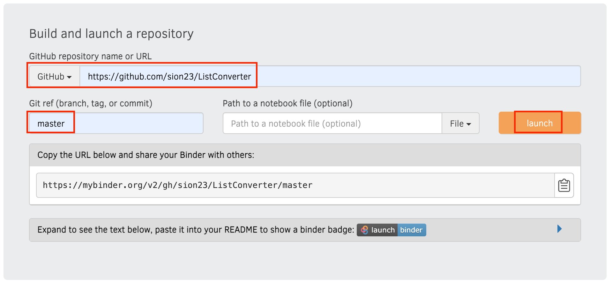
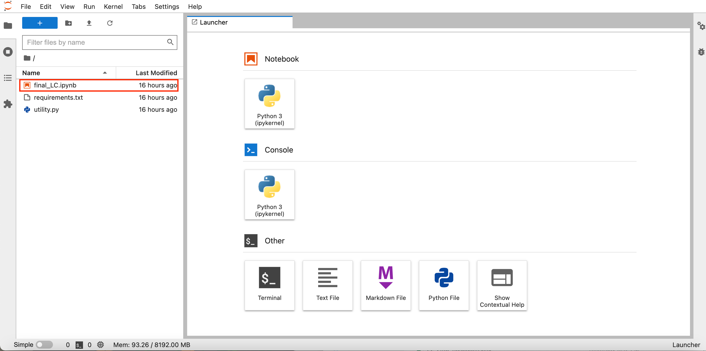
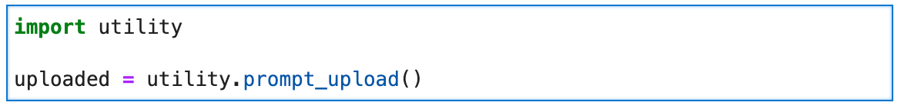
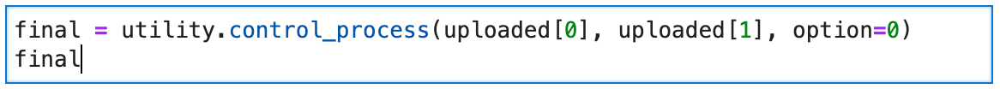
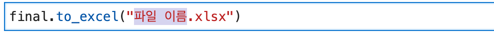
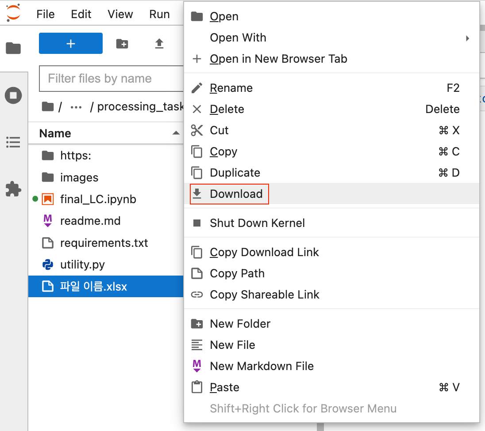
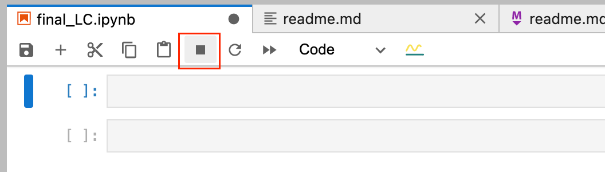

### Generate 일람표 from coding confirmation

1. Binder site 방문 (https://mybinder.org/):
- GitHub 선택 확인 후 입력: `https://github.com/medisafepv/ListConverter`
- Git ref 입력: `master`

2. Launch (1-5분)

 

3. 왼쪽 파일 탐색기 패널에서 `final_LC.ipynb` 더블클릭

 

4. 첫번제 cell (아래 사진 참고) 클릭 $\rightarrow$ 파랗게 선택된 상태에서 cell 실행하세요 `Shift` + `Enter`. Cell 옆에 별표 `[*]`은 계산중이나 사용자 입력을 기다리는 뜻을 의미합니다.

 

5. `Upload(0)` 버튼을 누른 후 Coding Confirmation (.xlsx) 파일 선택하세요 $\rightarrow$ `Upload(1)` 표시 확인. 

* 다시 업로드는 제실행 하시면 됩니다 (1. cell 선택 2. cell 실행 `Shift` + `Enter`)

 

6. 두번제 cell 실행 (1. cell 선택 2. cell 실행 `Shift` + `Enter`)

 

### 일람표 만드는 법

문자 처리하는 두 가지 모드가 있습니다

1. 삭제 모드: 사용자가 입력한 문자와 정확히 일치하는 행(또는 열) 삭제
2. 수정 모드: Excel 테이블의 값을 편집 (실수의 경우 등). 예를 들어, ADR 열에 세 개의 값이 있는 경우 `["ADR", "non-ADR", "non ADR"]`, 두가지 방법으로 처리할 수 있습니다. 
    - "non-ADR"을 "non ADR"로 수정 (하이픈 `-` 제거)
    - 반대로 "non ADR"을 "non-ADR"로 수정 (하이픈 `-` 추가)

### 저장
일림표 만든 후, 저장 파일 이름을 편집하세요. 마지막으로 cell을 실행 해주세요. 왼쪽 파일 탐색기에서 엑셀 파일이 만들어집니다. 파일에 오른쪽 마우스 클릭 하시고 `download` 옵션을 선택하세요. 

프로그램 종료: 브라우저 창을 닫은 후, 저장에 대한 메시지가 나타나면 저장 안 함을 클릭하세요

### 참고 노트

어느 시점에서 입력 / 선택을 잘못한 경우, 중지 누르시고 (square button), 필요하신 cell을 제실행 하세요 (1. cell 선택 2. cell 실행 `Shift` + `Enter`)

